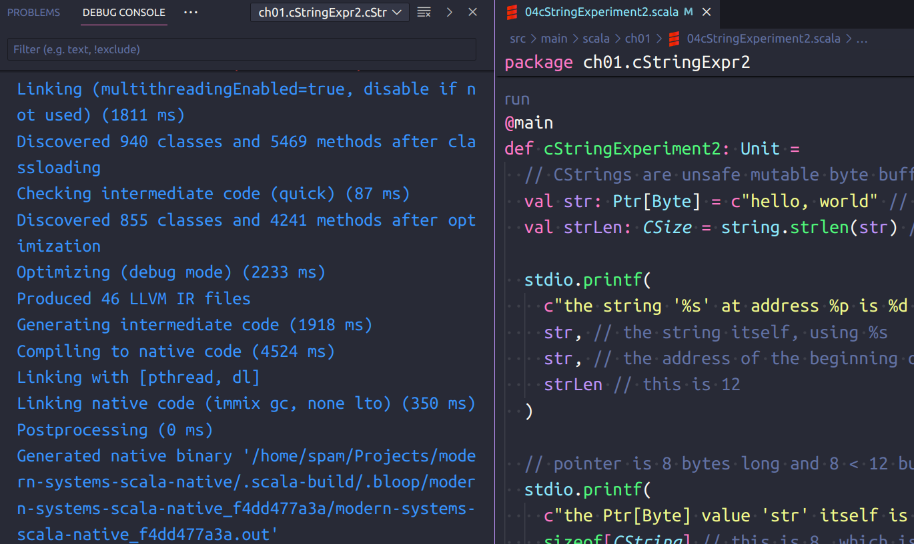
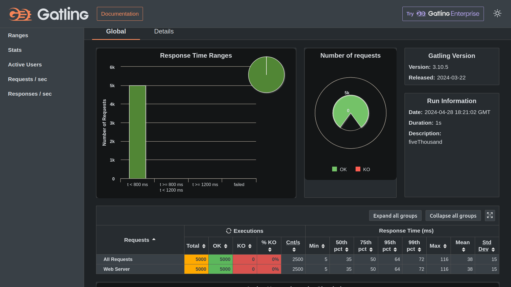
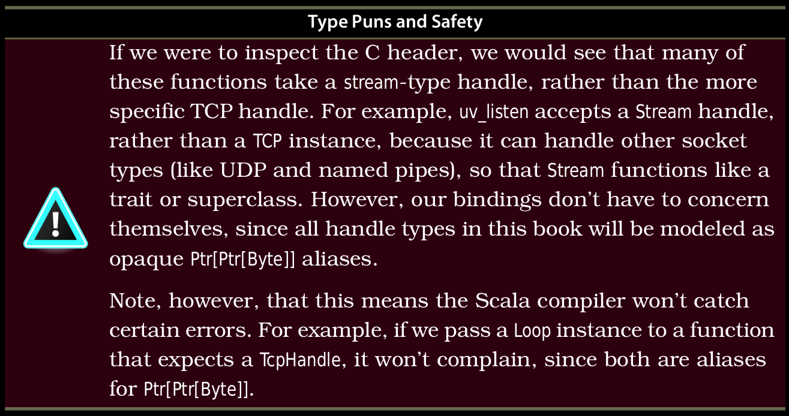

# Scala Native, using Scala 3

Updating the code in [Modern Systems Programming with Scala Native](https://pragprog.com/titles/rwscala/modern-systems-programming-with-scala-native/) to

- [Scala](https://www.scala-lang.org/) 3.4.1+,
- [Scala Native](https://scala-native.org/en/stable/) version 0.5.0+,
- `scala-cli` version 1.2.1+, and
- not using the Docker container provided by the [book's website](https://media.pragprog.com/titles/rwscala/code/rwscala-code.zip).

So I...

- changed the syntax to Scala 3 syntax:
- removed all the optional braces, added the fewer braces syntax,
- replaced `if (...) {...} else {...}` with `if ... then ... else ...` everywhere, using Python-style indentation,
- removed the `return` keyword, replaced `NonLocalReturns` usage with the new `util.boundary` and `boundary.break`,
- changed all the `snake_case` names to `camelCase`,
- got rid of unnecessary `main` object wrappings and used `@main` annotations instead,
- and so on.

## Compiling and running

You can compile and run `@main` methods in VS Code with Metals by clicking the run button above them:



### Compiling a `@main` method to a binary executable

There are 35+ `@main` methods in the project. To compile a specific one to a binary, you can use inside the root directory, for example:

```bash
scala-cli package . --main-class ch08.simplePipe.simplePipe
```

This will place the binary executable in the project root directory:

```bash
Wrote /home/spam/Projects/modern-systems-scala-native/ch08.simplePipe.simplePipe, run it with
  ./ch08.simplePipe.simplePipe
```

Here the class is the import path to the method: `ch08` and `simplePipe` are package names, and `simplePipe` is the name of the `@main` method:

```scala
package ch08
package simplePipe

// ...

@main
def simplePipe: Unit = ??? // so this is ch08.simplePipe.simplePipe
```

If in doubt, you can use the `--interactive` mode, which lets you pick the `@main` method you want:

```bash
$ scala-cli package . --interactive
Found several main classes. Which would you like to run?
[0] ch01.hello.helloWorld
[1] ch06.asyncTimer.asyncTimer
[2] ch09.jsonSimple.jsonSimple
[3] ch05.httpServer.httpServer05
[4] ch08.fileOutputPipe
[5] ch01.helloNative.helloNative
[6] ch06.asyncHttp.asyncHttp
[7] ch09.lmdbSimple.lmdbSimple
[8] ch08.fileInputPipe
[9] ch01.testing.testNullTermination
[10] ch01.cStringExpr1.cStringExperiment1
[11] ch01.sscanfInt.sscanfIntExample
[12] ch01.badStuff.testingBadStuff
[13] ch08.filePipeOut.filePipeOut
[14] ch02.agg.aggregateAndCount
[15] ch01.goodSscanf.goodSscanfStringParse
[16] ch01.badSscanf.badSscanfStringParse
[17] ch04.badExec.badExec
[18] ch07.simpleAsync.simpleAsync
[19] ch06.asyncTcp.asyncTcp
[20] ch03.http.httpClient
[21] ch08.simplePipe.simplePipe
[22] ch01.maxNgramFast.maxNgramFast
[23] ch07.curlAsync.curlAsync
[24] ch02.sort.sortByCount
[25] ch08.filePipe.filePipeMain
[26] ch03.tcp.tcpClient
[27] ch01.maxNgramNaive.maxNgramNaive
[28] ch04.nativePipeTwo.nativePipeTwo
[29] ch01.moreTesting.run
[30] ch01.cStringExpr2.cStringExperiment2
[31] ch04.nativeFork.nativeFork
[32] ch04.nativePipe.nativePipe
[33] ch10.libUvService.libuvService
[34] bug.run
[35] ch07.timerAsync.timerAsync
21
[info] Linking (multithreadingEnabled=true, disable if not used) (2353 ms)
[info] Discovered 1119 classes and 7040 methods after classloading
[info] Checking intermediate code (quick) (76 ms)
[info] Discovered 1050 classes and 5504 methods after optimization
[info] Optimizing (debug mode) (2199 ms)
[info] Produced 9 LLVM IR files
[info] Generating intermediate code (1689 ms)
[info] Compiling to native code (3083 ms)
[info] Linking with [pthread, dl, uv]
[info] Linking native code (immix gc, none lto) (239 ms)
[info] Postprocessing (0 ms)
[info] Total (9395 ms)
Wrote /home/spam/Projects/modern-systems-scala-native/ch08.simplePipe.simplePipe, run it with
  ./ch08.simplePipe.simplePipe
```

### Linking to external C libraries

The book uses `@link` and `= extern` constructs of Scala Native to link with libraries such as `libuv`, `libcurl` and `liblmdb`. For example:

```scala
@link("lmdb")
@extern
object LmdbImpl:
  def mdb_env_create(env: Ptr[Env]): Int = extern
  def mdb_env_open(env: Env, path: CString, flags: Int, mode: Int): Int = extern
```

On Ubuntu I had to install these (I think `libcurl` might have been pre-installed already?):

```bash
sudo apt install libuv1 libuv1-dev libcurl4 libcurl4-dev liblmdb0 liblmdb-dev
```

The author did all of this work. But if we wanted to do this on our own,
it would be difficult to get right the type signatures of the functions.
Scala Native main contributor's advice is to directly take
[the header file of such a library](https://github.com/libuv/libuv/blob/v1.x/include/uv.h),
and use [`sn-bindgen`](https://github.com/indoorvivants/sn-bindgen) to generate the bindings:


I haven't tried that myself, but that's the way to go.

### Running the Gatling load simulation

I modified the `install_gatling.sh` script from the book,
now it's `installGatling.sh` with Gatling bundle version 3.10.5+.

From the root directory, run

```bash
./installGatling.sh
```

This will download into a folder `gatling` in the root directory,
and copy the simulation file from chapter 5 into the relevant subdirectory.

You need to compile and run the HTTP server from chapter 5.
Read the compilation message for the name of the binary executable:

```bash
scala-cli package . --main-class ch05.httpServer.httpServer
...
Wrote /home/spam/Projects/modern-systems-scala-native/project, run it with
  ./project
```

Then run that to start the server. This starts the server listening on port 8080.

I wrote another script `runGatling.sh` that sets up the needed environment variables.
This will compile the simulation file under `gatling/user-files/simulations/`.
These files have to be written in Scala 2.13 unfortunately! Gatling cannot handle Scala 3.
So... run the interactive simulation with:

```bash
./runGatling.sh
```

Here's what the Terminal output looks like:

```bash
$ ./runGatling.sh
GATLING_HOME is set to /home/spam/Projects/modern-systems-scala-native/gatling
Do you want to run the simulation locally, on Gatling Enterprise, or just package it?
Type the number corresponding to your choice and press enter
[0] <Quit>
[1] Run the Simulation locally
[2] Package and upload the Simulation to Gatling Enterprise Cloud, and run it there
[3] Package the Simulation for Gatling Enterprise
[4] Show help and exit
1
Gatling 3.11.1 is available! (you're using 3.10.5)
ch05.loadSimulation.GenericSimulation is the only simulation, executing it.
Select run description (optional)
fiveThousand
Simulation ch05.loadSimulation.GenericSimulation started...

================================================================================
2024-04-28 18:21:04 GMT                                       2s elapsed
---- Requests ------------------------------------------------------------------
> Global                                                   (OK=5000   KO=0     )
> Web Server                                               (OK=5000   KO=0     )

---- Test scenario -------------------------------------------------------------
[##########################################################################]100%
          waiting: 0      / active: 0      / done: 100
================================================================================

Simulation ch05.loadSimulation.GenericSimulation completed in 2 seconds
Parsing log file(s)...
Parsing log file(s) done in 0s.
Generating reports...

================================================================================
---- Global Information --------------------------------------------------------
> request count                                       5000 (OK=5000   KO=0     )
> min response time                                      5 (OK=5      KO=-     )
> max response time                                    116 (OK=116    KO=-     )
> mean response time                                    38 (OK=38     KO=-     )
> std deviation                                         15 (OK=15     KO=-     )
> response time 50th percentile                         35 (OK=35     KO=-     )
> response time 75th percentile                         50 (OK=50     KO=-     )
> response time 95th percentile                         64 (OK=64     KO=-     )
> response time 99th percentile                         72 (OK=72     KO=-     )
> mean requests/sec                                   2500 (OK=2500   KO=-     )
---- Response Time Distribution ------------------------------------------------
> t < 800 ms                                          5000 (100%)
> 800 ms <= t < 1200 ms                                  0 (  0%)
> t >= 1200 ms                                           0 (  0%)
> failed                                                 0 (  0%)
================================================================================

Reports generated, please open the following file: file:///home/spam/Projects/modern-systems-scala-native/gatling/results/genericsimulation-20240428182101491/index.html
```

The graphical results are in `gatling/results/.../index.html`.
With 1000 users and 50000 requests, I got 1% failure rate (connection timeouts), and 300ms average response time.
Quite amazing!



## Differences from the book

I noticed many things have changed.

### Unused lines of code in the book (probably errors)

There are lines of code in the zip file provided on [the book's website](https://media.pragprog.com/titles/rwscala/code/rwscala-code.zip). Some of these are also printed in the book!

For example, in Chapter 4's `nativeFork` there is

```scala
for (j <- (0 to count)) {
}
```

which does nothing. There is also

```scala
val pid = unistd.getpid()
```

which is never used. There are lots of other examples. There are also many unused / unnecessary imports in the files. Whenever I ran into these, I removed them.

There is also a lot of code duplication, I suppose, to make each individual file "runnable" by itself. I removed redundant code by adding package declarations, then importing the duplicated code from other files instead.

For example, Chapter 4's `badExec.scala` duplicates a lot of code from `nativeFork.scala`. I solved it by separating duplicate code into a file, and adding package declarations:

```scala
// this is common.scala
package ch04

// ...
```

```scala
// this is nativeFork.scala
package ch04
package nativeFork

// ...
// then use code from common.scala here
```

```scala
// this is badExec.scala
package ch04
package badExec

// ...
// then use code from common.scala here
```

There is a lot of this duplication in later chapters. I'll fix them.

### `CSize / USize` instead of `Int`

The book uses `Int`s for a lot of calculations such as string length, how much memory should be allocated, etc. But the current version of Scala Native is using `CSize` for these now. So the `Int`s have to be converted. `CSize / USize` are actually `ULong`, so we need `.toCSize`, or `.toUSize`, or `.toULong` conversion. For this, we need to import:

```scala
import scalanative.unsigned.UnsignedRichLong
```

This also works:

```scala
import scalanative.unsigned.UnsignedRichInt
```

Moreover, we are now [able to use direct comparison](https://github.com/scala-native/scala-native/pull/3584) between `CSize` / `USize` types and `Int`. For example:

```scala
// here strlen returns CSize, normally we would have to do 5.toULong
if string.strlen(myCString) != 5 then ???
```

### `stackalloc` default argument with optional parentheses

There are many function calls in the book that only take type arguments and no value arguments, such as `stackalloc[Int]` etc. This is because there is a default argument `n` with value `1` if none is provided, and in Scala 2 we can drop empty parentheses: `stackalloc[Int]` instead of `stackalloc[Int]()`.

In Scala 3, we need to provide the empty parentheses for the default parameter of `1`, or just provide `1` as an argument:

```scala
stackalloc[Int] // does not work in Scala 3
stackalloc[Int]() // this defaults to n = 1
stackalloc[Int](1) // same as previous
```

### Type puns via `.cast`

The book uses things like

```scala
val server_sockaddr = server_address.cast[Ptr[sockaddr]]
```

`.cast` is no longer available; we use `.asInstanceOf[...]` instead.

### Creating function pointers

Function pointer classes now have different syntax. The book overrides classes like `CFuncPtr2` by providing a custom `apply` method like so:

```scala
val by_count = new CFuncPtr2[Ptr[Byte],Ptr[Byte],Int] {
  def apply(p1:Ptr[Byte], p2:Ptr[Byte]):Int = {
    val ngram_ptr_1 = p1.asInstanceOf[Ptr[NGramData]]
    val ngram_ptr_2 = p2.asInstanceOf[Ptr[NGramData]]
    val count_1 = ngram_ptr_1._2
    val count_2 = ngram_ptr_2._2
    return count_2 - count_1
  }
}
```

We can no longer do this, as these classes are declared `final`. We must use the companion object's `fromScalaFunction[...]` method instead (which is nicer, since we don't have to remember that we have to implement `def apply`):

```scala
val byCount = CFuncPtr2.fromScalaFunction[Ptr[Byte], Ptr[Byte], Int]:
  (p1: Ptr[Byte], p2: Ptr[Byte]) =>
    val ngramPtr1 = p1.asInstanceOf[Ptr[NGramData]]
    val ngramPtr2 = p2.asInstanceOf[Ptr[NGramData]]
    ngramPtr2._2 - ngramPtr1._2
```

### Typos, type puns and signatures for `libuv` (and other external C libraries)

The book and the code have some inconsistencies.
There are sometimes two different names for the same thing,
and the types are also different: For example:

```scala
// these are supposed to be the same thing.
type Timer = Ptr[Ptr[Byte]]       // book, ch06
type TimerHandle = Ptr[Byte]      // book, later in the same chapter

type TimerHandle = Ptr[Byte]      // code, in ch06
type TimerHandle = Ptr[Ptr[Byte]] // code, in other chapters
```

The book clearly says, in a "warning box":



Not sure how to handle this, it will be guesswork.
If compilation fails during linking phase then I'll know the types are wrong.
But if linking does not fail, then I'll have to figure it out from the execution.

### String copying and null-terminating

The book uses the usual C idiom of *allocating memory that is 1 more than the length of a string, copying it, then manually null-terminating the new copy*:

```scala
val string_ptr = toCString(arg) // prepare pointer for malloc
val string_len = string.strlen(string_ptr) // calculate length of string to be copied
val dest_str = stdlib.malloc(string_len + 1).asInstanceOf[Ptr[Byte]] // alloc 1 more
string.strncpy(dest_str, string_ptr, arg.size + 1) // copy
dest_str(string_len) = 0 // manually null-terminate the new copy
```

If you do this you'll get errors: first is the `CSize` errors:

```scala
arg.size + 1
```

when you are trying to add 1, which is `Int`, to `string_len`, which is `CSize`, for which you have to use `.toUSize`.

The second is `none of the overloaded alternatives for method update of Ptr[Byte]...` which complains when we are trying to manually null-terminate the new copy of the string:

```scala
dest_str(string_len) = 0
```

It has to be `Byte` instead.

Fixing all these problems and rewriting in Scala 3 style, we get:

```scala
val stringPtr = toCString(arg) // prepare pointer for malloc
val strLen = string.strlen(stringPtr) // calculate length of string to be copied
val destStr = stdlib.malloc(strLen + 1.toUSize) // alloc 1 more
string.strncpy(destStr, stringPtr, strLen) // copy JUST the string, not \0
destStr(strLen) = 0.toByte // manually null-terminate the new copy
```

or we can simply copy the string, including the null-terminator:

```scala
val stringPtr = toCString(arg) // prepare pointer for malloc
val strLen = string.strlen(stringPtr) // calculate length of string to be copied
val destStr = stdlib.malloc(strLen + 1.toUSize) // alloc 1 more
string.strncpy(destStr, stringPtr, strLen + 1.toUSize) // copy, including \0
```

If we for some reason don't trust `strncpy` and want extra super-duper safety, we can do both:

```scala
val stringPtr = toCString(arg) // prepare pointer for malloc
val strLen = string.strlen(stringPtr) // calculate length of string to be copied
val destStr = stdlib.malloc(strLen + 1.toUSize) // alloc 1 more
string.strncpy(destStr, stringPtr, strLen + 1) // copy, including \0
destStr(strLen) = 0.toByte // null-terminate the new copy, JUST IN CASE!
```

Now it's null terminated twice: once with the copying, then again manually.

### Command line arguments: `String*` instead of `Array[String]`

The book uses the old-school C-style "`argv`" approach to command-line arguments from Scala 2:

```scala
object Main {
  def main(args: Array[String]): Unit = {
    ???
  }
}
```

This does not work with Scala 3 `@main` annotations, as it will complain about `no given instance of type scala.util.CommandLineParser.fromString[Array[String]]...` Things have changed in Scala 3 when it comes to main methods, command line arguments and code-running. They have been greatly simplified, the main method no longer has to be named "main", and now there is greater capability to use any user-defined type for the command-line arguments, but the compiler has to be "taught" how to do it.

We could do that by providing the given instance... but instead we fall back on the "arbitrary number of parameters of the same type" approach (and rename the method while we're at it):

```scala
@main
def nativePipeTwo(args: String*): Unit = ???
```

### Unable to reliably reproduce segmentation faults

In Scala 3.4.1+, Native 0.5.0+, the `bad_sscanf_string_parse` example given in the book does not cause a segfault like it does in the book. Or rather, we have to use a *very long* string to get a segfault, like > 100 characters. If we use the author's version (Scala 2.11, Native 0.4.0, and some old SBT version) then it works; we get a segfault immediately with as few as 8 characters every time. It won't segfault even with `stackalloc[CString](1)`.

So I'm gonna drop down into C to see some reliable, reproducible segfault examples.

Well... that produced the same result, only for large string inputs (around 30 characters but not reliably).

```bash
./segfault
dddddddddddddddddddddddddd
scan results: dddddddddddddddddddddddd
ddddddddddddddddddddddddddd
scan results: ddddddddddddddddddddddddddd
dddddddddddddddddddddddddddd
malloc(): corrupted top size
Aborted (core dumped)
```
